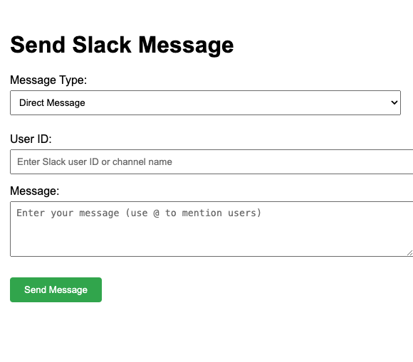

# Slack Message Sender

A web application for sending direct messages and channel messages in Slack with user mention autocomplete functionality.



## Architecture

The application follows a client-server architecture:

### Backend (Node.js + Express)
- **Server**: Express.js server handling API endpoints and static file serving
- **Slack Integration**: Uses `@slack/web-api` for communicating with Slack's APIs
- **API Endpoints**:
  - `/search-users`: GET endpoint for user search and mention suggestions
  - `/send-message`: POST endpoint for sending messages to users/channels

### Frontend (HTML + JavaScript)
- **UI Components**:
  - Message type selector (DM/Channel)
  - Recipient input
  - Message composer with @mention support
  - Status display
- **Features**:
  - Real-time user search for @mentions
  - Dynamic recipient field validation
  - Asynchronous message sending
  - Interactive mention suggestions

## Setup

1. Create a Slack App in your workspace:
   - Go to https://api.slack.com/apps
   - Click "Create New App"
   - Choose "From scratch"
   - Select your workspace

2. Configure your Slack App:
   - Under "OAuth & Permissions", add these bot token scopes:
     - `chat:write`
     - `im:write`
     - `channels:read`
     - `groups:read`
   - Install the app to your workspace
   - Copy the "Bot User OAuth Token" (starts with `xoxb-`)

3. Set up the application:
   ```bash
   # Install dependencies
   npm install

   # Update .env file with your Slack bot token
   # Replace 'your_slack_bot_token_here' with the actual token
   ```

4. Start the server:
   ```bash
   npm start
   ```

5. Open http://localhost:3000 in your browser

## Usage

1. Select message type (Direct Message or Channel Message)
2. For Direct Messages:
   - Enter a Slack user ID (get this from their profile in Slack)
3. For Channel Messages:
   - Enter the channel name (without the #)
4. Type your message
5. Click "Send Message"

Note: The bot must be invited to any private channels before it can post messages there.
